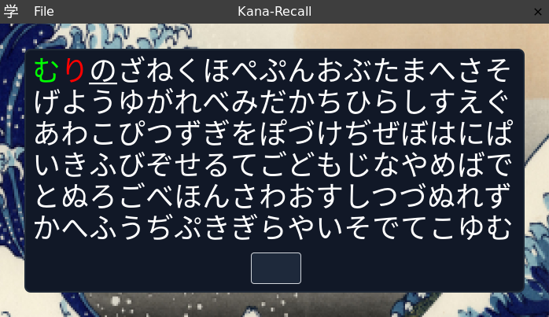

# Kana-Recall

Lightweight application for improving accuracy and recall time when reading Hiragana and Katakana.

For web version, visit [here](https://nicolasnewman.github.io/Kana-Recall/)

For desktop releases, visit [here](https://github.com/NicolasNewman/Kana-Recall/releases)
